# Bibliography Hallucinations Checker — Technical Documentation

> **Quick start**: See [README.md](../README.md) for installation and usage.

## Table of Contents

1. [Overview](#overview)
2. [Architecture](#architecture)
3. [PDF Processing Pipeline](#pdf-processing-pipeline)
4. [Reference Verification Pipeline](#reference-verification-pipeline)
5. [Backend Services](#backend-services)
6. [Configuration](#configuration)
7. [API Endpoints](#api-endpoints)
8. [Data Flow](#data-flow)
9. [Frontend](#frontend)
10. [Security](#security)
11. [Deployment](#deployment)
12. [Development](#development)

---

## Overview

The Bibliography Hallucinations Checker is a Flask web application that verifies bibliographic references in PDF documents against online academic databases. It detects "hallucinated" references — citations that appear in a paper's bibliography but do not correspond to real, published works.

The application processes PDFs by extracting bibliography sections, splitting them into individual references, and then verifying each reference against a pipeline of seven backend services. Results are returned via AJAX polling with progress tracking.

### Key Design Decisions

- **Flask app factory pattern** with Blueprint for testability and modularity
- **Thread-safe singleton backends** to avoid redundant HTTP client initialization
- **ThreadPoolExecutor** (4 workers) for parallel reference verification
- **6-step verification pipeline** with fallback chain: DOI → DOI healing → arXiv → URL → title search → web search
- **4-strategy reference splitting** to handle bracketed, numbered, author-year, and fallback formats
- **CSRF protection** via Flask-WTF
- **Exponential backoff retry** for rate-limited API responses

---

## Architecture

### Directory Structure

```
Bibliography Hallucinations Checker/
├── app/
│   ├── __init__.py          # App factory, config, registration
│   ├── routes.py            # Blueprint 'main', HTTP handlers
│   ├── pdf_processor.py     # PDF bibliography extraction
│   ├── checkers/
│   │   ├── __init__.py      # Public API (check_reference)
│   │   ├── orchestrator.py  # 6-step verification pipeline
│   │   ├── config.py        # Thresholds, retry logic
│   │   ├── extraction.py    # DOI/arXiv/URL/title extraction
│   │   ├── normalizer.py    # Unicode, similarity scoring
│   │   └── backends/
│   │       ├── __init__.py  # Backend imports
│   │       ├── base.py      # Abstract BackendService
│   │       ├── openalex.py  # OpenAlex backend
│   │       ├── crossref.py  # Crossref backend
│   │       ├── datacite.py  # DataCite backend
│   │       ├── arxiv.py     # arXiv backend
│   │       ├── url_checker.py # URL verification backend
│   │       ├── web_fallback.py # DuckDuckGo fallback
│   │       └── dblp.py      # DBLP CS fallback
│   └── templates/
│       ├── base.html        # Bootstrap 5 base
│       ├── index.html       # Upload form + AJAX polling
│       ├── results.html     # Jinja2 results table
│       └── error_413.html   # File-too-large error
├── docs/
│   └── ARCHITECTURE.md      # This file
├── .env.example             # Environment template
├── pyproject.toml           # Hatch build config
├── requirements.txt         # Pinned dependencies
├── run.py                   # Dev entry point
└── wsgi.py                  # WSGI entry point
```

### Component Diagram

```mermaid
flowchart LR
    subgraph Client["Client"]
        B["Browser<br/>(AJAX poll)"]
    end

    subgraph App["Flask App"]
        BP["Blueprint"]
        OR["Orchestrator<br/>(6-step pipeline)"]
    end

    subgraph PDF["PDF"]
        PP["PDF Processor<br/>(PyMuPDF)"]
    end

    subgraph Backends["Verification Backends"]
        OA["OpenAlex"]
        CR["Crossref"]
        DC["DataCite"]
        AX["arXiv"]
        UC["URL Checker"]
        WF["Web Fallback<br/>(DuckDuckGo)"]
        DB["DBLP<br/>(CS)"]
    end

    B <--> BP
    BP --> PP
    BP --> OR
    OR --> OA
    OR --> CR
    OR --> DC
    OR --> AX
    OR --> UC
    OR --> WF
    OR --> DB

    style Client fill:#1e1e2e,stroke:#999,stroke-width:1px
    style App fill:#3e2723,stroke:#fd7e14,stroke-width:2px
    style PDF fill:#1b5e20,stroke:#4caf50,stroke-width:2px
    style Backends fill:#0d47a1,stroke:#2196f3,stroke-width:2px
```



---

## PDF Processing Pipeline

The PDF processing pipeline in `app/pdf_processor.py` extracts bibliography sections from PDFs through four stages.

### Stage 1: Block Extraction

Uses **PyMuPDF** (fitz) layout-aware block extraction to parse the PDF into text blocks while preserving spatial information (x0, y0, x1, y1 coordinates).

```python
blocks = page.get_text("blocks")
# Each block: (x0, y0, x1, y1, "text", block_no, block_type)
```

### Stage 2: Header Detection

Identifies the start of the bibliography section by scanning block text for common headings:

- "References", "Bibliography", "Works Cited", "Bibliografia", "Riferimenti"
- Case-insensitive matching, with OCR typo catch "rererences"
- First match determines the bibliography start point

### Stage 3: Termination Scanning

Scans from the bibliography start to find where references end by detecting:

- Section headings (e.g., "Acknowledgments", "Appendix")
- ~30 termination keywords including English, Italian, and common variants
- Appendix table/figure captions and pure numeric table rows
- Non-reference streak heuristic (consecutive blocks lacking DOI/year/author signals)

### Stage 4: Reference Splitting

Splits the bibliography text into individual references using **four strategies** in order:

1. **Bracketed numbers**: `^\s*\[\d+\]` (e.g., `[1]`, `[42]`)
2. **Numbered**: `^\s*\d+\.` (e.g., `1.`, `2.`)
3. **Author-year**: Bracketed author-year patterns like `[Author, Year]` (e.g., `[Smith, 2020]`)
4. **Fallback**: One block per reference (last resort)

Each strategy uses regex to find split points, then extracts reference text between consecutive split points.

### Line Number Filtering (Three-Layer)

A three-layer filter removes line numbers before splitting:

1. **Layer 1 — Marginal block detection**: Narrow, purely numeric blocks in the left/right margin (x < 50pt or x > page_width − 50pt) are discarded during block extraction.
2. **Layer 2 — Embedded line number stripping**: Standalone 1–4 digit lines within a text block are removed from the joined text before splitting.
3. **Layer 3 — Per-reference cleanup**: Each extracted reference is individually scrubbed of trailing standalone numbers.

The result is a list of cleaned reference strings ready for verification.

---

## Reference Verification Pipeline

The verification pipeline in `app/checkers/orchestrator.py` implements a **6-step fallback chain** for each reference.

### Pipeline Steps

```
Step 1: DOI Lookup
    │
    ├── DOI found? ──▶ Step 2: DOI Healing (if needed)
    │                       │
    │                       ├── DOI healed? ──▶ Retry Step 1
    │                       │
    │                       └── DOI not healed ──▶ Continue to Step 3
    │
    └── No DOI ──▶ Step 3: arXiv Lookup
                       │
                       ├── arXiv ID found? ──▶ Return result
                       │
                       └── No arXiv ID ──▶ Step 4: URL Verification
                                            │
                                            ├── URL found? ──▶ Verify against backend
                                            │
                                            └── No URL ──▶ Step 5: Title Search
                                                           │
                                                           ├── Relevance ≥ 0.50? ──▶ Search backends
                                                           │
                                                           └── Relevance < 0.50 ──▶ Step 6: Web Fallback
                                                                                                    │
                                                                                                    ──▶ DuckDuckGo search
                                                                                                    ──▶ Rank results
                                                                                                    ──▶ Return best match
```

### Step Details

#### Step 1: DOI Lookup

- Extracts DOI from reference text using regex patterns
- Queries OpenAlex, Crossref, and DataCite in parallel
- Returns first successful match

#### Step 2: DOI Healing

Handles DOIs that are broken across PDF line breaks:

1. Detects DOIs ending with `10.` when the continuation is separated by space or newline
2. Rejoins the DOI: `10. 1234/abcd` → `10.1234/abcd`
3. Retries lookup with healed DOI

#### Step 3: arXiv Lookup

Extracts arXiv IDs using multiple patterns:

- `arXiv:YYYY.MM.NNNN`
- `arxiv.org/abs/YYMM.NNNNN`
- `abs/arXiv:YYYY.MM.NNNN`

Queries arXiv Atom feed API for metadata.

#### Step 4: URL Verification

Extracts URLs from reference text and verifies them:

1. Fetches HTML/PDF content
2. Follows meta-refresh redirects
3. Extracts title from HTML `<title>` tag
4. Falls back to keyword overlap if no title found

#### Step 5: Title Search

Uses **SequenceMatcher**-based similarity scoring with two key improvements:

1. **Normalization**: Applies a ligature-only character map (fi → fi, fl → fl, ffi → ffi, etc.) instead of full NFKD decomposition. This preserves accented characters (ü, ö, í, ç, ï, é) in international names and titles, which NFKD would decompose into base character + combining mark, and which `normalize_text()` would then strip.
2. **Length penalty**: When one title is a substring of another, the score is multiplied by `min_len / max_len`. This prevents short titles like "stance detection a survey" from incorrectly matching longer titles like "deep learning in stance detection a survey" with inflated scores (the wrong paper now scores ~0.44 instead of ~0.75).
3. **Relevance gate**: Only proceeds if similarity ≥ 0.50 (raised from 0.35)
4. Queries backends in order: OpenAlex → DBLP → Crossref → DataCite

#### Step 6: Web Fallback

Last resort using **DuckDuckGo Instant Answer API**:

1. Searches for the reference title
2. Ranks results by keyword overlap with original text
3. Verifies the top result's page is accessible
4. Returns best match or "not_found"

---

## Backend Services

All backends implement the `BackendService` abstract base class (`app/checkers/backends/base.py`):

```python
class BackendService(ABC):
    @abstractmethod
    def lookup_by_doi(self, doi: str) -> dict: ...
    @abstractmethod
    def lookup_by_id(self, identifier: str) -> dict: ...
    @abstractmethod
    def lookup_by_title(self, title: str, full_ref: str = "") -> dict: ...
    @abstractmethod
    def lookup_by_url(self, url: str, reference_title: str) -> dict: ...
```

### 1. OpenAlexBackend

- **API**: [OpenAlex](https://openalex.org/) (via `pyalex`)
- **Purpose**: Primary DOI lookup and title search
- **Features**:
  - DOI lookup via `https://api.openalex.org/works/doi/{doi}`
  - Title search with relevance filtering
  - Automatic email header for API usage tracking

### 2. CrossrefBackend

- **API**: [Crossref](https://www.crossref.org/) (via `habanero`)
- **Purpose**: DOI-only lookup for Crossref-indexed works
- **Features**:
  - DOI lookup via Crossref REST API
  - Handles DOI resolution failures gracefully

### 3. DataCiteBackend

- **API**: [DataCite](https://datacite.org/)
- **Purpose**: DOI lookup for Zenodo and repository DOIs
- **Features**:
  - DOI lookup via DataCite REST API
  - Complements Crossref for preprint and dataset DOIs

### 4. ArxivBackend

- **API**: arXiv Atom feed (`http://export.arxiv.org/api/query`)
- **Purpose**: arXiv paper lookup
- **Features**:
  - Queries by arXiv ID or title
  - **Thread-safe rate limiting** to respect arXiv's usage policy
  - Parses Atom XML for metadata extraction

### 5. URLCheckerBackend

- **Method**: Direct HTTP fetch
- **Purpose**: Verify standalone URLs (preprints, web pages)
- **Features**:
  - Fetches HTML/PDF content
  - Follows meta-refresh redirects
  - Extracts title from `<title>` tag
  - Keyword overlap fallback when no title available

### 6. WebFallbackBackend

- **API**: DuckDuckGo (`duckduckgo-search` library)
- **Purpose**: Last-resort web search
- **Features**:
  - Searches for reference title
  - Ranks results by keyword overlap boost
  - Verifies page accessibility
  - Returns best match or "not_found"

### 7. DBLPBackend

- **API**: DBLP JSON API (`https://dblp.org/search/publ/api`)
- **Purpose**: CS conference/journal proceedings fallback
- **Features**:
  - Title search via XML API
  - Pagination support (up to `DBLP_MAX_PAGES` pages)
  - Rate limiting (min delay between requests)
  - Found/candidate threshold filtering

### Backend Selection Logic

```python
def _get_openalex() -> OpenAlexBackend:
    if _openalex is None:
        _openalex = OpenAlexBackend()
    return _openalex
# Similar pattern for each backend (lazy singleton)
```

---

## Configuration

All thresholds and parameters are in `app/checkers/config.py`:

### Verification Thresholds

| Parameter | Default | Description |
|-----------|---------|-------------|
| `RELEVANCE_THRESHOLD` | 0.50 | Minimum similarity for title search to proceed |
| `WEB_FALLBACK_TRIGGER` | 0.60 | Similarity threshold for triggering web fallback |
| `TITLE_SIMILARITY_THRESHOLD` | 0.75 | Web search page-verification threshold |
| `DBLP_FOUND_THRESHOLD` | 0.60 | DBLP similarity threshold for "found" status |
| `DBLP_CANDIDATE_THRESHOLD` | 0.40 | DBLP similarity threshold for "candidate" status |
| `DBLP_MAX_RESULTS` | 10 | Max results per DBLP query page |
| `DBLP_MAX_PAGES` | 2 | Max pages to paginate in DBLP search |
| `DBLP_MIN_DELAY` | 1.0 | Min delay between DBLP requests (seconds) |

### Retry Configuration

| Parameter | Default | Description |
|-----------|---------|-------------|
| `MAX_RETRIES` | 3 | Max retry attempts for API calls |
| `RETRY_BASE_DELAY` | 1.0 | Base delay for exponential backoff (seconds) |

### Timeout Configuration

| Parameter | Default | Description |
|-----------|---------|-------------|
| `REQUEST_TIMEOUT` | 10 | HTTP request timeout (seconds) |

### URL Checker Configuration

| Parameter | Default | Description |
|-----------|---------|-------------|
| `URL_REJECT_FLOOR` | 0.20 | Minimum similarity floor for keyword-overlap fallback |
| `URL_KEYWORD_OVERLAP_MIN` | 3 | Minimum overlapping words to accept despite low similarity |

### Pipeline Configuration

| Parameter | Default | Description |
|-----------|---------|-------------|
| `MAX_WORKERS` | 4 | ThreadPoolExecutor workers for parallel ref checking |
| `ARXIV_MIN_DELAY` | 3.0 | Minimum seconds between arXiv API requests (their rate limit) |

### Retry Logic

The `execute_with_retry()` function in `config.py` handles rate-limit retries with exponential backoff:

```python
def execute_with_retry(func, max_retries=3, *args, **kwargs):
    """Execute func with exponential backoff on 429 / rate-limit errors."""
    for attempt in range(max_retries):
        try:
            return func(*args, **kwargs)
        except Exception as e:
            err_msg = str(e).lower()
            if "429" in err_msg or "too many requests" in err_msg:
                wait = (2 ** attempt) + 1
                time.sleep(wait)
                continue
            raise
    return func(*args, **kwargs)
```

---

## API Endpoints

### POST `/`

Upload a PDF for bibliography verification.

**Request**:
- `multipart/form-data` with `file` field (PDF, max 16MB)
- CSRF token via `X-CSRFToken` header

**Response** (AJAX):
```json
{
    "job_id": "abc123",
    "status": "processing"
}
```

**Processing**:
1. Validates file type (PDF) and size (≤ 16MB)
2. Extracts bibliography via `extract_bibliography()`
3. Creates job in `_jobs` dict with ThreadPoolExecutor
4. Starts the background TTL cleanup thread (first use)
5. Returns `job_id` for polling

**Error responses**:
- `400`: Invalid file type
- `413`: File too large (triggers custom error handler)
- `500`: Processing error

### GET `/status/<job_id>`

Poll for job progress and results.

**Response**:
```json
{
    "status": "processing | complete | error",
    "checked": 42,
    "total": 50,
    "results": [...],  // Only present when status == "complete"
    "error": "..."     // Only present when status == "error"
}
```

### GET `/`

Display upload form (non-AJAX request).

---

## Data Flow

### Upload-to-Results Flow

```
1. User uploads PDF
   │
2. routes.py: index()
   ├── Validates file (PDF, ≤ 16MB)
   ├── Creates temp file
   │
3. pdf_processor.py: extract_bibliography(temp_path)
   ├── Stage 1: PyMuPDF block extraction
   ├── Stage 2: Header detection ("References", etc.)
   ├── Stage 3: Termination scanning
   ├── Stage 4: Reference splitting (4 strategies)
   └── Returns: List[Reference]
   │
4. routes.py: ThreadPoolExecutor.submit()
   ├── Worker calls checkers.orchestrator.check_reference(ref)
   │
5. orchestrator.py: check_reference(reference)
   ├── Step 1: DOI lookup (OpenAlex + Crossref + DataCite)
   ├── Step 2: DOI healing (if broken DOI detected)
   ├── Step 3: arXiv lookup
   ├── Step 4: URL verification
   ├── Step 5: Title search (relevance gate ≥ 0.35)
   └── Step 6: Web fallback (DuckDuckGo)
   │
6. Results aggregated and stored in _jobs[job_id]
   │
7. Frontend polls /status/<job_id> until complete
   │
8. results.html renders comparison table
```

### Reference Object Schema

Current code uses dicts (not classes) with keys: `number`, `original`, `doi`, `arxiv_id`, `url`

### Check Result Schema

Current code uses dicts (not classes) with keys: `status`, `source`, `title`, `author`, `pub_year`, `venue`, `url`, `similarity`, `message`, `reason`

---

## Frontend

### Templates

#### `index.html`

- Bootstrap 5 card-based upload form
- AJAX file upload with CSRF token
- Processing overlay with animated progress bar
- JavaScript polling (`/status/<job_id>`) every 1 second
- Dynamic results rendering (client-side HTML construction)
- `escapeHtml()` utility for XSS prevention

#### `results.html`

- Jinja2 template for results table
- Status badges: Found (green), Check Match (orange), Candidate (blue), Skipped (gray), Error (orange), Not Found (red)
- Source badges: OpenAlex (blue), Crossref (light blue), DataCite (green), arXiv (dark), DBLP (yellow)
- Similarity score badges with color coding:
  - ≥ 80%: Green
  - 60–80%: Orange border
  - < 60%: Red
- Low-similarity rows highlighted with orange background
- "Back to top" floating button

#### `base.html`

- Bootstrap 5 base template
- CSRF token injection
- Flash message support

### Styling

- **Orange accent** (`#fd7e14`) for "Check Match" status (low similarity found references)
- **Bootstrap 5** utility classes for layout
- **Progress bar** with striped animation during processing
- **Table-responsive** wrapper for mobile compatibility

---

## Security

### CSRF Protection

Flask-WTF CSRF protection is enabled globally:

```python
csrf = CSRFProtect(app)
```

All POST requests require a valid CSRF token.

### File Validation

1. **MIME type check**: Only `application/pdf` accepted
2. **File size limit**: 16MB (configurable via `MAX_CONTENT_LENGTH`)
3. **Temp file cleanup**: Uploaded files are deleted after processing

### 413 Error Handling

Custom handler for file-too-large errors:

```python
@app.errorhandler(413)
def requested_entity(error):
    return render_template('error_413.html'), 413
```

### Secret Key

`SECRET_KEY` is read from environment variable (not hardcoded). Generated via `os.urandom(32)` in `.env.example`.

### TTL Job Cleanup

The `_jobs` dictionary (used for AJAX polling) is bounded by a background cleanup thread (`app/routes.py::_cleanup_worker`). The thread wakes every 60 seconds and removes jobs whose `completed_at` timestamp is older than 5 minutes. The cleanup thread is started lazily on first job creation and is protected against race conditions by `_cleanup_start_lock`. It runs as a daemon thread so it exits cleanly when the process terminates.

### Request Timeout

All HTTP requests to external APIs use a 10-second timeout (configurable via `REQUEST_TIMEOUT` in `app/checkers/config.py`) to prevent hanging.

### SSRF Protection

All server-side URL fetching passes through `app/checkers/backends/security.py::validate_url_for_fetch()`, which enforces three layers of validation:

1. **Scheme whitelist** — Only `http` and `https` are allowed. Schemes like `file://`, `ftp://`, `gopher://` are rejected.
2. **Bare IP rejection** — URLs with numeric IP addresses (IPv4 or IPv6) are blocked to force DNS resolution.
3. **DNS resolution check** — The hostname is resolved via `socket.getaddrinfo()` and every returned IP is checked against a blocklist of private, loopback, link-local, multicast, and reserved ranges (per RFC 1918, RFC 3927, RFC 4291, etc.). Results are cached via `@lru_cache` to avoid repeated lookups.

Meta-refresh redirects are validated against the same rules before the redirect is followed. Blocked URLs produce a `ValueError` that is caught and logged at DEBUG level.

---

## Deployment

### Environment Variables

| Variable | Required | Description |
|----------|----------|-------------|
| `SECRET_KEY` | Yes | Flask secret key for session/CSRF |
| `OPENALEX_EMAIL` | No | Email header for OpenAlex API |
| `OPENALEX_API_KEY` | No | API key for OpenAlex rate limit increase |
| `FLASK_DEBUG` | No | Set to `1` for debug mode |
| `LOG_LEVEL` | No | Logging level (default: `INFO`) |

### WSGI Deployment

```python
# wsgi.py
from app import create_app
application = create_app()
```

Standard Gunicorn/uWSGI deployment:

```bash
gunicorn -w 4 -b 0.0.0.0:8000 wsgi:application
```

### Development

```bash
# run.py
from app import create_app
app = create_app()
app.run(debug=True)
```

### Dependencies

Installed via `pyproject.toml` (Hatch build) or `requirements.txt`:

- **Core**: Flask, Flask-WTF, PyMuPDF, requests
- **Backends**: pyalex (OpenAlex), habanero (Crossref), duckduckgo-search
- **Processing**: python-Levenshtein (optional fast similarity)

---

## Development

### Adding a New Backend

1. Create `app/checkers/backends/<name>.py`:

```python
from .base import BackendService

class NewBackend(BackendService):
    def lookup_by_doi(self, doi: str) -> dict:
        # Implementation
        ...

    def lookup_by_id(self, identifier: str) -> dict:
        return {"status": "not_found"}

    def lookup_by_title(self, title: str, full_ref: str = "") -> dict:
        return {"status": "not_found"}

    def lookup_by_url(self, url: str, reference_title: str) -> dict:
        return {"status": "not_found"}
```

2. Register in `app/checkers/backends/__init__.py`:

```python
from .new_backend import NewBackend
__all__ = [..., "NewBackend"]
```

3. Add singleton accessor in `app/checkers/orchestrator.py`:

```python
_new_backend = None

def _get_new_backend() -> NewBackend:
    global _new_backend
    if _new_backend is None:
        _new_backend = NewBackend()
    return _new_backend
```

4. Add to pipeline in `check_reference()` if needed.

### Modifying Thresholds

Edit `app/checkers/config.py`. All thresholds are module-level constants.

### Testing

Run the application locally and verify:

1. PDF upload and bibliography extraction
2. Reference verification against each backend
3. Progress tracking via AJAX polling
4. Error handling (invalid files, network failures)

### Logging

Log levels are configurable via `LOG_LEVEL` environment variable. Key log points:

- `pdf_processor.py`: Block extraction, header detection, reference splitting
- `orchestrator.py`: Pipeline step entry/exit, backend selection
- `backends/*.py`: API requests, response parsing, similarity scoring

---

## Version History

- **v1.11.0**: pymupdf 1.28 compatibility (_looks_like_reference_ signal threshold 2→1 for narrower blocks), habanero 2.9.2 (automatic 429 retry, connection pooling), dependency updates across werkzeug, python-dotenv, ddgs, flask-wtf, pyalex; cleaned up stale test files
- **v1.9.1**: Fixed title extraction for single-line PDF references: smart period-split avoids false boundaries at author→title and venue bleed points, expanded `COMMON_TITLE_WORDS` with domain-specific terms, tightened venue detection to only flag parts that *start with* "In [Venue]" or known publisher names, added `strip_venue_suffix` support for "In Proceedings" without colon, added standalone first-word surname stripping in `strip_author_header`.
- **v1.9.0**: International character preservation (replaces NFKD with ligature-only map), length-aware similarity scoring (penalizes substring matches to prevent false positives), raises RELEVANCE_THRESHOLD from 0.35 to 0.50.
- **v1.8.0**: Added TTL job cleanup (background thread removes completed jobs after 5 min), SSRF protection (IP validation + scheme whitelisting for all URL fetching), underscore URL healing for DOI paths with spaces, and Unicode-aware author detection.
- **v1.1.4 → v1.7.2**: Major development spanning security hardening, parallel processing, DBLP backend, AJAX polling, DOI healing, title extraction improvements, and Unicode normalization.

See git log for detailed commit history.
